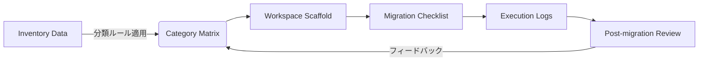

# アーキテクチャ設計書 — Workspace Optimization Project

## 目的
本ドキュメントは、`~/workspace` への開発ディレクトリ統合プロジェクトにおいて、情報構造・作業フロー・成果物配置の基盤を定義する。ログ駆動開発 (LDD) を支えるドキュメント体系と、移行後のディレクトリ構造ルールを明文化することを目的とする。

## 全体像
- **入力**: 現在のローカル開発ディレクトリ (`/Users/shunsuke/Dev`, `/Users/shunsuke/projects`, `/Users/shunsuke/tools`, `/Users/shunsuke/go`)、付随ドキュメント、Git リポジトリメタデータ。
- **プロセス**: Inventory → Classification Policy → Workspace Scaffold → Migration Plan → Execution → Post-migration Review の 6 フェーズ。
- **出力**: `~/workspace` 配下の標準化ディレクトリ、移行ログ、更新されたドキュメント (`docs/*.md`, `.ai/*`)。

## システム構成要素
### 1. 情報レイヤ
- `.ai/prd.md`: フェーズ定義と KPI を保持する唯一の真実の情報源。
- `.ai/arch.md`: 作業プロセスと成果物ディレクトリの関係を定義 (本書)。
- `.ai/stories/`: フェーズを分解したストーリー単位の実装指針。
- `.ai/logs/`: codex_prompt_chain, tool_invocations, handoff_summary を時系列で格納。
- `docs/`: 実際の棚卸し・移行計画・分類ポリシー等のユーザー向け成果物。

### 2. 作業レイヤ
| レイヤ | 主スコープ | 成果物 | 担当 |
| --- | --- | --- | --- |
| Inventory | 現状資産の列挙・計測 | `docs/inventory.md` | STORY-001 |
| Policy | カテゴリ分類ルール確立 | `docs/classification_policy.md` (新規) | STORY-002 |
| Scaffold | `~/workspace` の生成 | shell スクリプト / 証跡ログ | STORY-003 |
| Planning | 移行パス・順序の合意 | `docs/migration_plan.md` | STORY-004 |
| Execution | 実際のディレクトリ移行 | 作業ログ, @memory-bank.mdc | STORY-005 |
| Review | 成果検証と改善提案 | `docs/post_migration_review.md` | STORY-006 |

### 3. ディレクトリ構造リファレンス
```
~/workspace/
  active/       # 継続開発中リポジトリ (Git HEAD 追従, CI 稼働)
  incubate/     # PoC・短期検証 (破壊的変更許容)
  archive/      # 参照専用 (読み取りメイン)
  learning/     # 教材・サンプル・チュートリアル
  tools/        # 共通ツール・ユーティリティ
  data/         # 言語別ワークスペース、バイナリアセット、キャッシュ
```
- 物理移動前に `docs/migration_plan.md` で各リポジトリのターゲットパスを確定する。
- それぞれのサブディレクトリには `README.md` を配置し、目的とオンボード手順を記載する。

## LDD ログフロー
1. **意図 (intent)**: ストーリー開始時に `.ai/logs/codex_prompt_chain.md` へ追記。
2. **計画 (plan)**: ストーリー定義を参照し、具体的サブタスクとツールを記録。
3. **実装 (implementation)**: ファイル更新とコマンド実行結果を `tool_invocations.log` に記載。
4. **検証 (verification)**: テスト結果と残課題を `@memory-bank.mdc` に同期し、ハンドオフを準備。

## データフロー

- Mermaid 図はアーキテクチャ検証時に参照。
- 実際のオートメーション実装時は `scripts/` 配下に YAML を入力とするツールを配置予定。

## セキュリティと権限
- `danger-full-access` 環境での移行操作は、手順書に定義されたチェックリストを満たした場合のみ実行。
- API キーやシークレットを含む `.env` ファイルは移行対象から除外し、必要に応じて `.gitignore` を整備。

## 未決事項
- `docs/classification_policy.md` のフォーマットと承認フロー。
- 自動化スクリプト (Python/Go) の実装可否。
- `workspace` フォルダのバックアップ方式 (TimeMachine or 手動スナップショット)。

