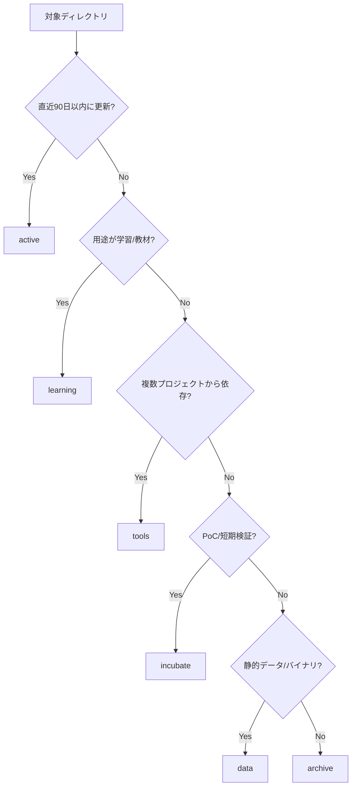

# ディレクトリ分類ポリシー

本ポリシーは `~/workspace` への移行時に各リポジトリ・ディレクトリを適切なカテゴリへ割り当てるための基準を定義する。STORY-002 の成果物としてレビュー・承認を受けることを前提とする。

## カテゴリ定義
| カテゴリ | 想定用途 | 必須条件 | 任意条件 | 代表例 (暫定) |
| --- | --- | --- | --- | --- |
| active | 継続開発・運用中のリポジトリ | 直近90日以内に更新がある / CI が稼働 | コラボレーション中、依存サービス稼働 | `dify_workflow_gen_mcp` |
| incubate | PoC・実験中のプロジェクト | 検証目的で短期的な更新が見込まれる | 分岐ブランチ多数、要素技術検証 | `AI_entrepreneur_Agent` |
| archive | 参照のみの完了プロジェクト | 直近180日間更新無し / 将来の復元ニーズあり | リリースタグ済み、ドキュメント完備 | `test_codex_Tetris` |
| learning | 学習コンテンツ・教材 | リポジトリがチュートリアル・講座目的 | README に学習手順が含まれる | `オンラインコース` |
| tools | 開発支援ツール・スクリプト | 複数プロジェクトから参照される | CLI/ライブラリ化されている | `github-mcp-server` |
| data | 言語別ワークスペース・バイナリ | ソースコード以外の静的データ | 大容量 (>1GB) または生成物 | `go/pkg` |

## 判定フロー

## 判定チェックリスト
- [ ] 直近の更新日とコミッターを確認した。
- [ ] README またはドキュメントで用途を確認した。
- [ ] 他リポジトリからの参照 (submodule, symlink, import) を調査した。
- [ ] 大容量ファイルの有無と用途を把握した。
- [ ] 分類結果を `docs/migration_plan.md` のマッピング表に反映した。

## 例外処理
- **複数カテゴリ該当**: 「active」優先、その後 `docs/migration_plan.md` にセカンダリカテゴリを備考として記載。
- **分類保留**: 未判定のまま移行せず、`@memory-bank.mdc` にフォローアップタスクを登録。
- **共有データ**: 同一データを複数カテゴリで利用する場合は `data/` へ集約し、必要に応じてシンボリックリンクを作成。

## レビュー記録
| レビュワー | コメント | 日付 |
| --- | --- | --- |
| *(未記入)* | | |

## 変更履歴
- 2025-09-26: 初版作成。
